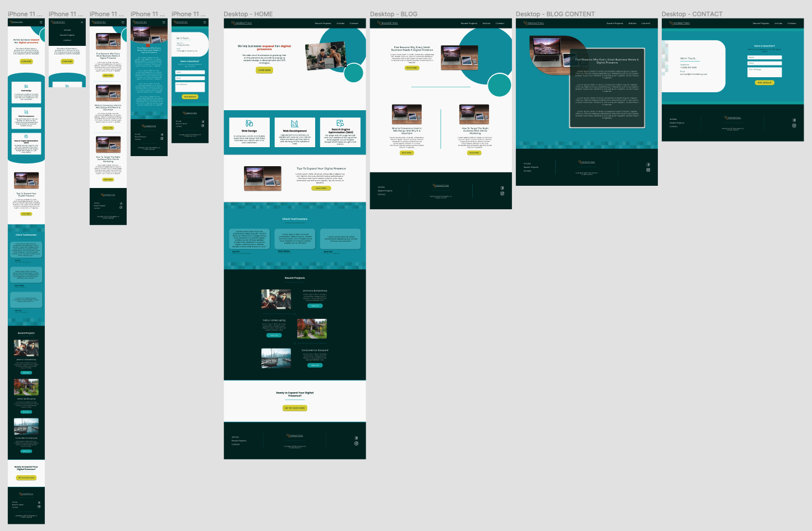

# NV Marketing, LLC

> NV Marketing, LLC is a web development & SEO service provider. This app has been built with Next.js.

#### [View The Site](https://nv-marketing.com) - This app is live.

<!-- Badge(s) Here -->

---

### Table of Contents

- [Description](#description)
- [Technologies](#technologies)
- [How To Use](#how-to-use)
- [Installation](#installation)
- [References](#references)
- [License](#license)
- [Contributors](#contributors)

---

## Description

This app was developed for NV Marketing, LLC to create a conversion-centric and mobile responsive website showcasing the services provided by the company.

This Next.js app is fully custom to the requirements of NV Marketing, LLC.

[Back To The Top](#project-name)

---

#### Technologies

- Next.js
- React.js
- Javascript
- HTML
- SCSS
- Email.js

[Back To The Top](#project-name)

---

## How To Use

View The Live Site - https://nv-marketing.com

[Back To The Top](#project-name)

---

#### Installation

Not applicable

[Back To The Top](#project-name)

---

## References

Not applicable

[Back To The Top](#project-name)

---

## License

Copyright (c) NV Marketing, LLC

[Back To The Top](#project-name)

---

## Contributors

- Nate Valline

[Back To The Top](#project-name)

## Tests

Not applicable

[Back To The Top](#project-name)

---

## Questions

Please contact the following for any questions.

 => contact@natevalline.com

[Back To The Top](#project-name)

---

## Lorem Ipsum Test Data

Lorem Ipsum is simply dummy text of the printing and typesetting industry. Lorem Ipsum has been the industry's standard dummy text ever since the 1500s, when an unknown printer took a galley of type and scrambled it to make a type specimen book. It has survived not only five centuries, but also the leap into electronic typesetting, remaining essentially unchanged. It was popularised in the 1960s with the release of Letraset sheets containing Lorem Ipsum passages, and more recently with desktop publishing software like Aldus PageMaker including versions of Lorem Ipsum.
